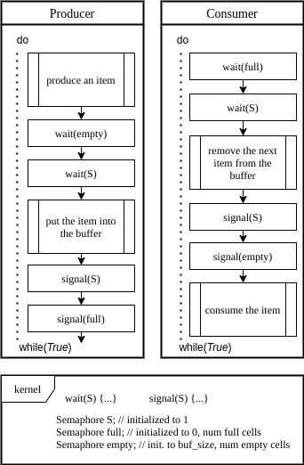

## 세마포어와 뮤택스

### 1. 세마포어

- `세마포어`는 여러 프로세스들의 공유 자원에 대한 접근 제어와 동기화를 지원하기 위한 정수로 선언된 동기화 도구이다.
- 일반적으로 세마포어의 초기 값은 공유 자원 혹은 임계 구역에 접근할 수 있는 프로세스의 수로 초기화한다.
- 세마포어는 공유 자원에 접근할 수 있는지를 판단하기 위해서 `스핀락(spin lock)`처럼 busy waiting으로 구현되지 않는다.


#### 1.1. 세마포어 연산

- **세마포어(`S`)는 `wait`과 `signal`이라는 atomic한 두 개의 연산을 갖는다.**

  > #### [세마포어의 Wait 연산]
  >
  > ```
  > Function wait(S) is
  > 	if S > 0 then
  > 		/* 프로세스를 block 시키지 않는다 */
  > 		S = S - 1;
  > 		return;
  > 	else
  > 		/* 프로세스를 block 시킨다. */
  > 		sleep;
  > 	end
  > end
  > ```
  >
  > - 세마포어(S)가 0보다 크면, 할당할 수 있는 공유 자원이 있다는 뜻이므로 세마포어 값을 1 감소시킨다.
  > - 세마포어(S)가 0이면, 할당할 수 있는 공유 자원이 없다는 뜻이므로 프로세스가 *sleep* 상태가 된다.
  >
  > 
  >
  > #### [세마포어의 Signal 연산]
  >
  > ```
  > Function Signal(S) is
  > 	if there a process sleeping on S then
  > 		select a process to wake up;
  > 		wake up the selected process;
  > 		return;
  > 	else
  > 		S = S + 1;
  > 		return;
  > 	end
  > end
  > ```
  >
  > - *sleep* 상태의 프로세스가 존재하지 않는다면, 공유 자원을 할당받기 위해 대기하고 있는 프로세스가 없다는 뜻이므로 세마포어 값을 1 증가시킨다.
  > - *sleep* 상태의 프로세스가 존재하면, 세마포어 값을 증가시키는 것 대신에  *sleep* 상태인 프로세스를 깨우고 그 프로세스에게 자원을 할당한다.


#### 1.2 세마포어 종류

1. Binary Semaphore

   - **Binary Semaphore는 오로지 두 개의 값 (0과 1)만을 갖는 세마포어이다.**  임계 영역에 동시에 하나의 프로세스만이 접근할 수 있도록할 때 사용한다.
   - Binary Semaphore와 뮤택스를 같은 것이라고 혼돈하는 경우가 있는데 전자는 *singnaling* 메카니즘을 나타내고 후자는 *locking* 메카니즘을 나타낸다. 자세한 설명은 아래 뮤택스 부분을 참고하자.

   

2. Counting Semaphore

   - **Counting Semaphore은 제한되지 않은 범위로 나타낼 수 있는 세마포어이다.** 여러 개의 자원을 할당할 때 나타나는 동기화 문제를 해결할 때 사용한다.

---

### 2. 세마포어 구현

- **세마포어의 구현은 세마포어 값을 나타낼 수 있는 정수 변수와 sleep 상태의 프로세스들을 저장하고 있는 연결 리스트로 구현할 수 있다.**  

---

### 3. 세마포어 적용 사례

#### 3.1. 임계 구역 문제

- 임계 구역 문제를 해결하기 위해서 **Binary Semaphore**를 사용할 수 있다. 이때 초기 세마포어 값은 1로 초기화 된다.


- 임계 구역에 접근하기 위해서 `busy waiting` 대신 프로세스는 *sleep* 상태에 들어간다. 임계 구역에서 동작을 끝낸 프로세스가 `signal` 연산을 통해 세마포어 값을 증가시키면 *커널*은 *sleep* 상태에 있는 프로세스를 `ready queue`로 이동시키고, 프로세스는 임계 구역 안으로 진입할 수 있다.


#### 3.2. 실행 순서 제어

- 프로세스의 실행 순서를 제어할 때에도 **Binary Semaphore**를 사용할 수 있다.
- 아래 그림은 *Process 0*에 의해서 실행되는 *S1* 영역이 *Process 1*에 의해서 실행되는 *S2* 영역보다 먼저 실행될 수 있도록 하는 방법을 보여준다.


- 초기 세마포어 x값은 0으로 초기화하고 *Process 0*은 `wait(x)` 연산 없이 *S1* 영역에 진입한 뒤, `signal(x)` 연산을 통해 x 값을 증가시킨다.
- *Process 1*은 *S2* 영역에 진입하기 전에 `wait(x)` 연산을 수행하기 때문에 *Process 0*이 `signal(x)` 연산을 수행할 때 까지 *sleep* 상태에 놓이게 된다.


#### 3.3. 한정 버퍼 생산자-소비자 문제

- 두 개의 세마포어 값(full, empty)를 이용해서 이 문제를 해결할 수 있다. *empty* 세마포어는 버퍼에 빈 공간이 있는지 나타내고 *full* 세마포어는 버퍼에 데이터가 저장되어 있는지를 나타낸다.



- Producer는 버퍼에 데이터를 저장하기 전에 `wait(empty)` 연산을 통해 버퍼에 빈 공간이 있는지 확인한다. 빈 공간이 있다면 버퍼에 데이터를 저장하고 (버퍼 또한 임계 구역이므로 wait(S) 연산을 통해 진입한다.) `signal(full)` 연산을 수행하여 Consumer가 버퍼에 접근할 수 있도록 한다.
- Consumer는 버퍼에 접근하여 데이터를 읽기 전에 `wait(full)` 연산을 통해 버퍼에 데이터가 저장되어 있는지 확인한다. 버퍼에 데이터가 저장되어 있다면 데이터를 읽고 `signal(empty)` 연산을 수행하여 Producer가 버퍼에 데이터를 저장할 수 있도록 한다.

---

### 3. 뮤택스

- 뮤택스 오브젝트는 동시에 하나의 프로세스만이 공유 자원에 접근할 수 있도록하는 매커니즘이다. 세마포어가 *signaling* 메커니즘에 기반하여 이 문제를 해결한다면 뮤택스는 *locking* 메커니즘을 사용한다.
- 프로세스가 시스템에 공유 자원에 대한 접근을 요청하면, 시스템은 뮤택스 오브젝트를 생성하고 프로세스는 그 오브젝트에 대한 *lock*을 획득한다. (*lock*의 소유자가 되었다고 표현하기도 한다.)
- 해당 프로세스가 공유 자원을 모두 사용하고 나면 뮤택스 오브젝트에 대한 *lock*을 반환한다. 그리고 다른 프로세스가 위와 같은 방식으로 공유 자원에 접근한다.

---

### 3. 세마포어와 뮤택스의 차이점

1. 뮤택스는 *locking* 매커니즘을 사용한다. 공유 자원에 접근할 때 뮤택스 오브젝트에 대한 lock을 획득하고 사용한 뒤에는 lock을 반납한다. 세마포어는 *signaling* 매커니즘을 사용하는데 `wait()` 과 `signal()` 메소드를 사용해서 공유 자원에 대한 사용 여부(?)를 나타낸다.
2. 뮤택스는 오브젝트이지만 세마포어는 정수 값이다.
3. 뮤택스는 동시에 하나의 프로세스만이 공유 자원에 접근할 수 있도록 하지만 세마포어는 동시에 접근할 수 있는 프로세스의 수를 조절할 수 있다. (Counting 세마포어의 경우, 세마포어 값에 따라 동시에 n개의 프로세스가 접근할 수 있다)
4. 뮤택스는 lock을 획득한 프로세스만이 해당 lock을 반환할 수 있지만, 세마포어는 다른 프로세스가 세마포어 값을 조작(?)할 수 있다. 즉, 데드락 상황이 발생했을 때 세마포어는 다른 프로세스가 값을 변경하여 데드락 상황을 회복할 수 있다. 그러나 뮤택스의 경우 lock을 소유한 프로세스가 *sleep* 상태에 있다면 해당 lock을 반환할 수 있는 방법이 없기 때문에 데드락 상태를 회복할 수 없다.

---

#### [출처]

[What is Semaphore? - Baeldung](https://www.baeldung.com/cs/semaphore#1-semaphore-operations)

[What is a Mutex? - Baeldung](https://www.baeldung.com/cs/what-is-mutex)

[Difference between Mutex and Semaphore in Operating System](https://afteracademy.com/blog/difference-between-mutex-and-semaphore-in-operating-system)

